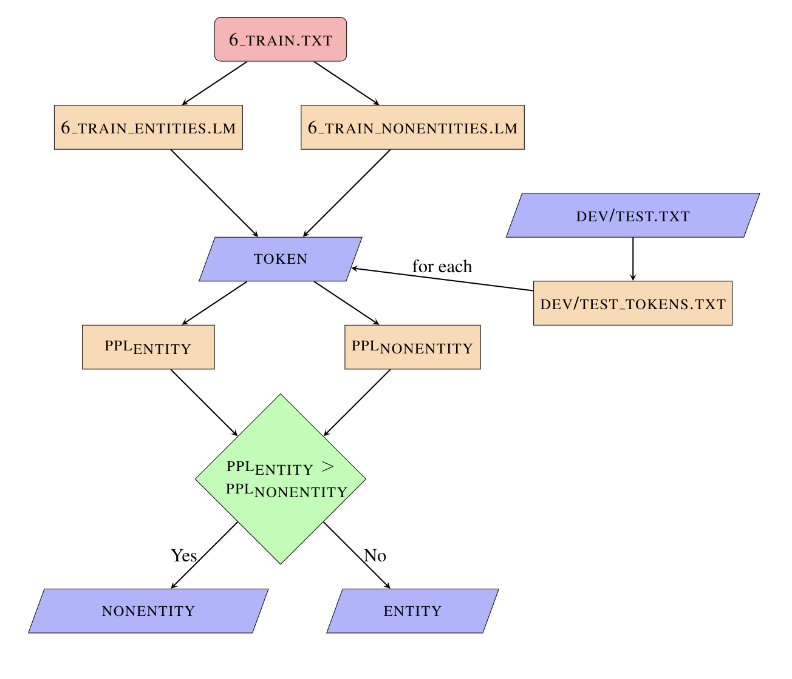

# CIS519 Final Project (NEI/NER)

Cindy Hao, Jeffrey Xiao

## Overview of Code Base

### `parser.py`

#### Breakdown of relevant files/folders

```
.
├── X_gold_labels   # contains train, dev, and test files for X labels (X={0,6,12,18})
├── CLM
│   └── .lm learning models for all entity/nonentity and training files (6,12,18)
├── NEI_labels
│   ├── expected
│   │   └── .txt files of expected labels for each dev/test file
│   ├── train_12
│   │   └── .txt files of actual labels for each dev/test file trained on 12
│   ├── train_18
│   │   └── .txt files of actual labels for each dev/test file trained on 18
│   └── train_6
│       └── .txt files of actual labels for each dev/test file trained on 6
├── parsed_character_files
│   ├── tokens
│   │   └── .txt files of all tokens in each dev/test file
│   └── .txt files of all entities/nonentities (separated) for training data
├── srilm-1.7.3
│   └── SRILM library for creating N-gram CLM models
└── parser.py   # main .py file run for NEI portion
```

This file was used primarily for the Named Entity Identification (NEI) portion of this project. In essence, `parser.py` contains methods for each step of the training and prediction process, as shown in the diagram below.



The end of this file contains code (commented out since this was run on Google Collab) for retrieving the accuracy scores for each trained/predicted file.

Overall, this identification process took a while due to having to parse and load many files, but the results of the training and prediction processes were relatively successful.

### `pickler.py`

#### Breakdown of relevant files

```
.
├── sent_example.pickle   # contains pickle data regarding entities and uses (NOT included in repo due to large size)
├── filtered_pickles.json   # json mapping keys to number of occurrences (instead of complete sentences)
└── pickler.py   # main .py file run for generating pickle data
```

This file was used to filter out the keys from the pickle data. The original pickle data (which was taken from the Wikilinks database) mapped keys to complete sentences/phrases. This caused the file to be massive and wouldn't open on our local computers. To get around this, we chose to create a new file with all of the keys mapped to the number of occurrences in an effort to create a more readable file. This was successful, as seen in `filtered_pickles.json`. The output would then be used in the NER portion to choose entities for each of the 18 labels.

### `labler.py`
